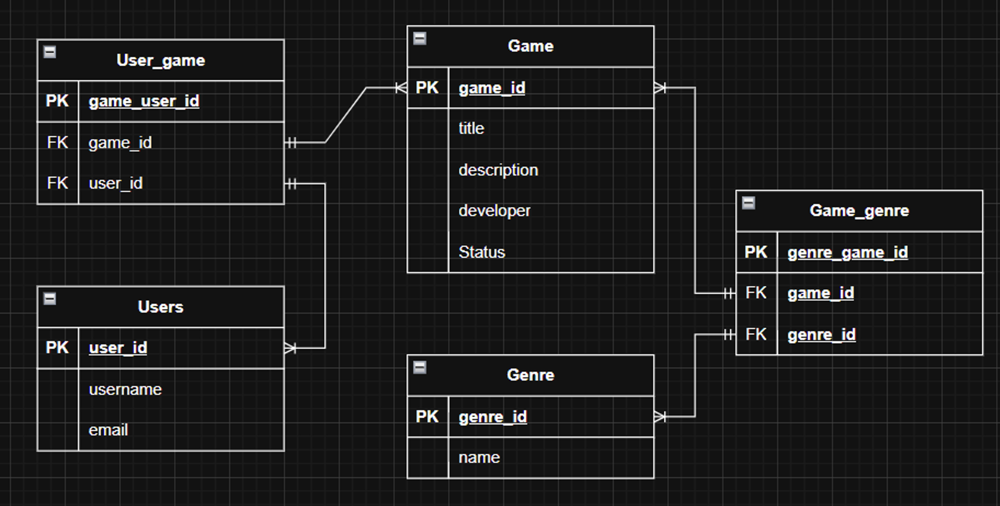

# Løsningsforslag – Datamodell for RALF

## Løsningsforslag

Under ser vi løsningsforslaget til datamodellen for RALF.

## Forklaring av løsningen

Datamodellen er bygget opp rundt tre hovedtabeller:

- **Users**
- **Game**
- **Genre**

I tillegg må vi lage **to ekstra tabeller**:

- **User_game**
- **Game_genre**

Grunnen til dette er at vi får **mange-til-mange-relasjoner** i databasen.

### Mange-til-mange mellom brukere og spill

En bruker kan være knyttet til mange spill, og ett spill kan være knyttet til mange brukere.

Dette kan ikke løses direkte i én tabell, så derfor lager vi koblingstabellen **User_game**.

### Mange-til-mange mellom spill og sjangre

Et spill kan ha flere sjangre, og en sjanger kan høre til flere spill.

Derfor må vi også lage koblingstabellen **Game_genre**.

## Tabeller i løsningen

### Users

Tabellen **Users** lagrer informasjon om brukerne.

Attributter:

- `user_id` **(PK)**
- `username`
- `email`

### Game

Tabellen **Game** lagrer informasjon om spillene.

Attributter:

- `game_id` **(PK)**
- `title`
- `description`
- `developer`
- `status`

### Genre

Tabellen **Genre** lagrer informasjon om sjangrene.

Attributter:

- `genre_id` **(PK)**
- `name`

### User_game

Tabellen **User_game** er en koblingstabell mellom brukere og spill.

Attributter:

- `game_user_id` **(PK)**
- `game_id` **(FK)**
- `user_id` **(FK)**

### Game_genre

Tabellen **Game_genre** er en koblingstabell mellom spill og sjangre.

Attributter:

- `genre_game_id` **(PK)**
- `game_id` **(FK)**
- `genre_id` **(FK)**

## Oppsummering

Løsningen består totalt av **fem tabeller**.  
De tre hovedtabellene er **Users**, **Game** og **Genre**.  
De to ekstra tabellene **User_game** og **Game_genre** må være med fordi vi har **mange-til-mange-relasjoner**.

Dette gjør datamodellen ryddig og riktig bygd opp.
